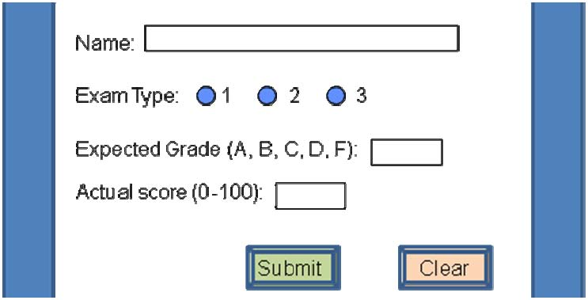

% COMP5222 Assignment 2
% Qu Xiaofeng
  09903198R

> COMP 5222    
> Software Testing and Quality Assurance    
> Assignment 1    
> *Due date: Nov 23, 2012 Total Mark: 50*    

# Question 1

### Given the following input screen,

## (a) For each input, give the equivalence classes. Note that *actual* score should be an integer. Use the following format: (6 marks)

-----------------------------------------------------------------------------------------------------------
Input           Type            EC                               Description
--------------- ------------    -------------------------------  ------------------------------------------
Name            40 Characters   [blank],[Characters within 40],  characters within 40 should be valid          
                                [too many Characters]

Exam Type       Number          [unselected],[1-3]               Selection should be from one of the three

Expected Grade  Character       [blank],[A-D],[E],[F],[G-Z]      Only Character A-D and F is valid
                                [multiple characters]

Actual Score    integer         [<0][0-100][>100][float number]  The score should a integar within 0-100         
------------------------------------------------------------------------------------------------------------

## (b) Give a list of test cases covering your EC. (4 marks)

-------------------------------------------------------------------------------------------
Input           Test Cases                       Expected Results
--------------- -------------------------------  ------------------------------------------
Name            [blank]                          Reject

                A                                Accept

                AAAAA                            Accept

                AAAAAAAAAAAAAA...(40)            Accept

                AAAAAAAAAAAAAA...(41)            Reject

                AAAAAAAAAAAAAA...(80)            Reject
-------------------------------------------------------------------------------------------

-------------------------------------------------------------------------------------------
Input           Test Cases                       Expected Results
--------------- -------------------------------  ------------------------------------------
Exam Type       [unselected]                     Reject

                1                                Accept

                2                                Accept

                3                                Accept
-------------------------------------------------------------------------------------------

-------------------------------------------------------------------------------------------
Input           Test Cases                       Expected Results
--------------- -------------------------------  ------------------------------------------
Expected Grade  [blank]                          Reject

                A                                Accept

                B                                Accept

                D                                Accept

                E                                Reject

                F                                Accept

                G                                Reject

                R                                Reject

                Z                                Reject

                AA                               Reject

                AAAAAAAA                         Reject
-------------------------------------------------------------------------------------------

-------------------------------------------------------------------------------------------
Input           Test Cases                       Expected Results
--------------- -------------------------------  ------------------------------------------
Actual Score    -30                              Reject

                -1                               Reject

                0                                Accept

                5                                Accept

                100                              Accept

                101                              Reject

                200                              Reject

                0.1                              Reject

                5.1                              Reject

                100.1                            Reject

                -0.1                             Reject

                -5.1                             Reject

                -100.1                           Reject
-------------------------------------------------------------------------------------------

# Question 2

### For the following case:

### The Boiler is controlled by a monitor system, which will shut down the Boiler if

+ Water level is below 20,000 lb
+ Water level is above 120,000 lb
+ Degraded mode and steam meter fails (Degraded mode when the water pump
has failed or the pump monitor has failed)

## (a) Identify all causes and effects. (6 marks)

-------------------------------------------------
Causes              Effects                   
------------------- -----------------------------
< 20,000lb          Shut down the Boiler

> 120,000lb         Shut down the Boiler

Degraded mode       Shut down the Boiler

Steam meter fails   Shut down the Boiler

< 20,000lb          Open water pump

> 120,000lb         Shut down water pump

Water is boiled     Shut down the Boiler

Water pump is opend Start the Boiler
--------------------------------------------------

## (b) Draw the cause and effect graph. (4 marks)

## (c) What test cases you should use? (6 marks)

---------------------------------------------------------------
 Test Cases          Expected Results
------------------   ------------------------------------------
19,999lb             Shut down the Boiler, open water pump

120,001lb            Shut down the Boiler, shut down water pump

Degraded mode        Shut down the Boiler

Steam meter fails    Shut down the Boiler

Water is boiled      Shut down the Boiler

Water pump is opened Start the Boiler
---------------------------------------------------------------

# Question 3

### Imagine that you were testing how Blackboard’s password manager saves login passwords.

## (a) Describe two approaches to develop a set of scenario tests that test this feature. (4 marks)

+ EP Testing

The password should be 

-----------------------------------------------------------------------------------------------------------
Input           Type                         ECs                                    
--------------- ---------------------------  -------------------------------------------------------------- 
Password        40 Characters and Digits     [blank],[Only Characters within 40],  
                start with a Character       [too many Characters],          
                                             [Only Digits within 40],
                                             [too many Digits],
                                             [Characters and Digits within 40 start with a Character],
                                             [Characters and Digits start with a Digit],
                                             [Characters containing an invalid character]
-----------------------------------------------------------------------------------------------------------

+ CT Testing

## (b) Describe a scenario test that you would use to test this feature. (3 marks)

I would use the EP testing to test this feature.

## (c) Explain why this is a particularly good scenario test. (5 marks)

The test cases are much less than other methods. And the test is more thorough and consice.

# Question 4

## (a) A software team follows this process for software development: (6 marks)

+ Develop requirements
+ Develop system tests
+ Design
+ Develop integration tests
+ Code
+ Develop unit tests
+ Execute unit tests
+ Execute integration tests
+ Execute system tests

### Where can we add inspection to this process?

+ Develop requirements, requirements doc inspection
+ Develop system tests, test plan inspection
+ Design, design doc inspection
+ Develop integration tests, test plan inspection
+ Code, code inspection
+ Develop unit tests, test plan inspection

## (b) Both code inspection and white-box testing focus on finding faults. Identify 3 advantages of doing code inspection over white-box testing. (3 marks)

1. In white-box testing, we have to write test cases. In inspection, we don't. It requires much more effort.

2. In white-box testing, we have to cover all the path. In inspection, we follow our own logic.

3. In white-box testing, only testers and programmers involved. In inspection, the project manager is also involved. The communication is better.

## (c) Identify which of the following tasks should not be performed by the moderator of the inspection team? (Deduct 1 mark for each incorrect selection) (3 marks)

1. Inspection Scheduling
2. Determine need for Overview
3. Determine Inspection team
4. Ensuring availability of materials
5. Give an overview
6. Preparation
7. Inspection Meeting
8. Data Recording
9. Rework
10. Follow-up

The answers are,

>(4). Ensuring availability of materials    
>(5). Give an overview    
>(8). Data Recording    

